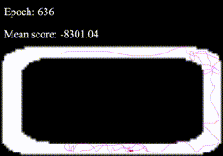

# CarTrack


_Auteurs:_ [Simon Audrix](mailto:saudrix@ensc.fr) & [Gabriel Nativel-Fontaine](mailto:gnativ910e@ensc.fr)

Ce dépôt contient notre travail dans le cadre du module **Reinforcement Learning** du parcours **Intelligence Artificielle** inscrit dans la 3ème année du cursus d'ingénieur au sein de l'[Ecole Nationale Supérieure de Cognitique](http://www.ensc.fr).


Pour lancer le projet:

```bash
$ git clone https://github.com/3a-ia-ensc/track-rl 
$ cd track-rl
$ pip install -r requirements.txt
$ python track.py
```

Une fois la fenêtre ouverte, appuyer sur la barre espace pour lancer l'entrainement.

## Resultats

<p align="center">
   
</p>

L'algorithme semble converger après environ 13000 itérations.

